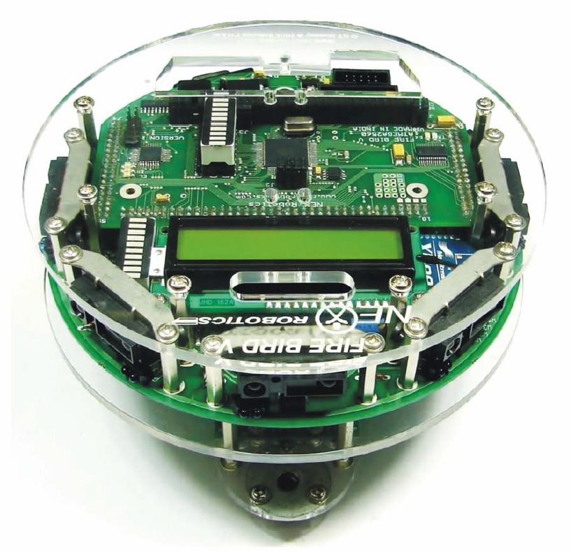

<!-- Improved compatibility of back to top link: See: https://github.com/othneildrew/Best-README-Template/pull/73 -->
<a name="readme-top"></a>
<!--
*** Thanks for checking out the Best-README-Template. If you have a suggestion
*** that would make this better, please fork the repo and create a pull request
*** or simply open an issue with the tag "enhancement".
*** Don't forget to give the project a star!
*** Thanks again! Now go create something AMAZING! :D
-->


<!-- PROJECT SHIELDS -->
<!--
*** I'm using markdown "reference style" links for readability.
*** Reference links are enclosed in brackets [ ] instead of parentheses ( ).
*** See the bottom of this document for the declaration of the reference variables
*** for contributors-url, forks-url, etc. This is an optional, concise syntax you may use.
*** https://www.markdownguide.org/basic-syntax/#reference-style-links
-->

<!-- PROJECT LOGO -->
<br />
<div align="center">
  <a href="https://https://github.com/IEEE-NITK/CSD-eYantra-Lab">
    
  </a>

<h3 align="center">CSD-EYantra-Lab</h3>

  <p align="center">
    EYantra Workshop conducted by IEEE NITK in collaboration with Center for System Design (CSD) as a part of the IEEE ICRAIE (International Conference on Recent Advances and Innovations in Engineering) Conference held on 1st December 2022.
    <br />
    <a href="https://https://github.com/IEEE-NITK/CSD-eYantra-Lab"><strong>Explore the docs »</strong></a>
    <br />
    <br />
  </p>
</div>


<!-- TABLE OF CONTENTS -->
<details>
  <summary>Table of Contents</summary>
  <ol>
    <li>
      <a href="#about-the-workshop">About the Workshop</a>
    </li>
    <li>
      <a href="#getting-started">Getting Started</a>
      <ul>
        <li><a href="#prerequisites">Firebird V Manual</a></li>
        <li><a href="#installation">Programming the Code into the Firebird V</a></li>
      </ul>
    <li><a href="#acknowledgments">Acknowledgments</a></li>
  </ol>
</details>


<!-- ABOUT THE WORKSHOP -->
## About The Workshop



The workshop entails the application of three codes with the functionalities of Buzzer test, Motion in a Square and Obstacle Avoidance on a Firebird V. 

A Firebird V is a versatile robot for study of open source hardware and embedded systems. It is an AtMega2560 microcontroller based robot, which provides the developer an excellent base for algorithm testing and real environment based experimentation. 

The FIREBIRD V is designed by NEX Robotics and Embedded Real Time Systems lab, CSE IIT Bombay.

<p align="right">(<a href="#readme-top">back to top</a>)</p>


<!-- GETTING STARTED -->
## Getting Started

This is an example of how you may get started on working with Firebird V and Embedded C.
To get a local copy up and running follow these simple example steps.

### Firebird V Manual

In order to work with a Firebird V, the following manuals are required. Follow the software manual for installation purposes.

Download here : <a href="https://drive.google.com/drive/folders/1GdCj5TaqzaT_NTc_QpTy5f5eUMnEj1Um?usp=sharing">Firebird V Manuals</a>

### Programming the Code into the Firebird V

The code included in this repository can be used to test the basic functions on the Firebird V.

1. Clone the repo - 
   ```sh
   git clone ttps://https://github.com/IEEE-NITK/CSD-eYantra-Lab
   ```

2. Open Microchip Studio. Create a new project of the type 'GCC C Executable'. Select an appropriate microcontroller device (for the Firebird V, we use ATMEGA 2560). 

3. Copy the required repo code into the project's main.c. Build the project. Debug the executable file. 

4. Open AVR Bootloader. Select the appropriate COM Port. Set the baudrate to 115200. Select the same microcontroller. Choose the .hex file generated automatically in the above project after completion of debugging.

5. In order to program the code into the Firebird V, select the 'program' option.

<!-- ACKNOWLEDGMENTS -->
## Acknowledgments

* [Hrishikesh Kulkarni](https://github.com/HrishiCoolkarni)
* [Nikhil Reddy](https://github.com/nikhilreddy2002)
* [Palgun Praveen](https://github.com/Palgun7)
* [Shivani Chanda](https://github.com/Shivani-Chanda)
* [Shobuj Paul](https://github.com/Shobuj-Paul)
* [Spandan Patkar](https://github.com/SpandanPatkar)
* [Sunaina Sunil](https://github.com/SunainaSunil)


<p align="right">(<a href="#readme-top">back to top</a>)</p>


<!-- MARKDOWN LINKS & IMAGES -->
<!-- https://www.markdownguide.org/basic-syntax/#reference-style-links -->
[contributors-shield]: https://img.shields.io/github/contributors/github_username/repo_name.svg?style=for-the-badge
[contributors-url]: https://github.com/github_username/repo_name/graphs/contributors
[forks-shield]: https://img.shields.io/github/forks/github_username/repo_name.svg?style=for-the-badge
[forks-url]: https://github.com/github_username/repo_name/network/members
[stars-shield]: https://img.shields.io/github/stars/github_username/repo_name.svg?style=for-the-badge
[stars-url]: https://github.com/github_username/repo_name/stargazers
[issues-shield]: https://img.shields.io/github/issues/github_username/repo_name.svg?style=for-the-badge
[issues-url]: https://github.com/github_username/repo_name/issues
[license-shield]: https://img.shields.io/github/license/github_username/repo_name.svg?style=for-the-badge
[license-url]: https://github.com/github_username/repo_name/blob/master/LICENSE.txt
[linkedin-shield]: https://img.shields.io/badge/-LinkedIn-black.svg?style=for-the-badge&logo=linkedin&colorB=555
[linkedin-url]: https://linkedin.com/in/linkedin_username
[product-screenshot]: images/screenshot.png
[Next.js]: https://img.shields.io/badge/next.js-000000?style=for-the-badge&logo=nextdotjs&logoColor=white
[Next-url]: https://nextjs.org/
[React.js]: https://img.shields.io/badge/React-20232A?style=for-the-badge&logo=react&logoColor=61DAFB
[React-url]: https://reactjs.org/
[Vue.js]: https://img.shields.io/badge/Vue.js-35495E?style=for-the-badge&logo=vuedotjs&logoColor=4FC08D
[Vue-url]: https://vuejs.org/
[Angular.io]: https://img.shields.io/badge/Angular-DD0031?style=for-the-badge&logo=angular&logoColor=white
[Angular-url]: https://angular.io/
[Svelte.dev]: https://img.shields.io/badge/Svelte-4A4A55?style=for-the-badge&logo=svelte&logoColor=FF3E00
[Svelte-url]: https://svelte.dev/
[Laravel.com]: https://img.shields.io/badge/Laravel-FF2D20?style=for-the-badge&logo=laravel&logoColor=white
[Laravel-url]: https://laravel.com
[Bootstrap.com]: https://img.shields.io/badge/Bootstrap-563D7C?style=for-the-badge&logo=bootstrap&logoColor=white
[Bootstrap-url]: https://getbootstrap.com
[JQuery.com]: https://img.shields.io/badge/jQuery-0769AD?style=for-the-badge&logo=jquery&logoColor=white
[JQuery-url]: https://jquery.com 
